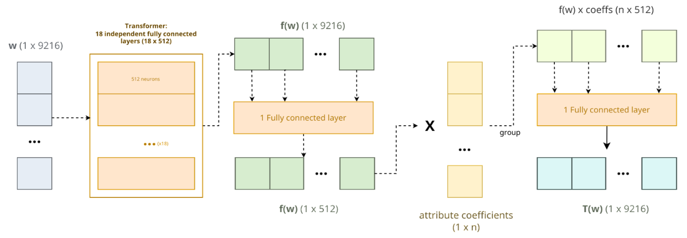
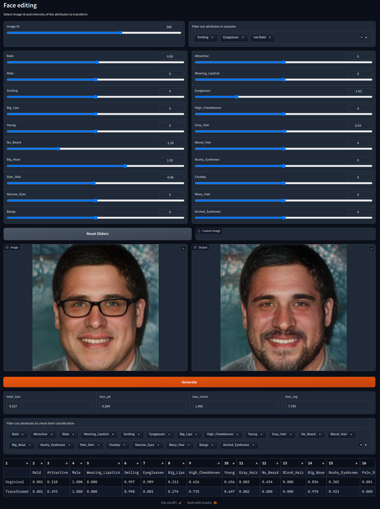

# Latent Multi-Attribute Transformer for Face Editing in Images

Official implementation for the Master Thesis project "Latent Multi-Attribute Transformer for Face Editing in Images."



## Installation Instructions

### Dependencies
The project mainly requires:
* Python 3.10
* PyTorch 1.13
* CUDA
* Gradio (optional for the UI)
 
You can create a conda environment using the provided `environment.yml` file:

```bash
conda env create -f environment.yml
conda activate multilat
```

Alternatively, you can install the dependencies directly from the `requirements.txt` file.

### Prepare StyleGAN2 encoder and generator

* We use the pretrained StyleGAN2 encoder and generator released from paper [Encoding in Style: a StyleGAN Encoder for Image-to-Image Translation](https://arxiv.org/pdf/2008.00951.pdf). Download and save the [official implementation](https://github.com/eladrich/pixel2style2pixel.git) to `pixel2style2pixel/` directory. Download and save the [pretrained model](https://drive.google.com/file/d/1bMTNWkh5LArlaWSc_wa8VKyq2V42T2z0/view) to `pixel2style2pixel/pretrained_models/`.

* In order to save the latent codes to the designed path, we slightly modify `pixel2style2pixel/scripts/inference.py`.

    ```
    # modify run_on_batch()
    if opts.latent_mask is None:
        result_batch = net(inputs, randomize_noise=False, resize=opts.resize_outputs, return_latents=True)
        
    # modify run()
    tic = time.time()
    result_batch, latent_batch = run_on_batch(input_cuda, net, opts) 
    latent_save_path = os.path.join(test_opts.exp_dir, 'latent_code_%05d.npy'%global_i)
    np.save(latent_save_path, latent_batch.cpu().numpy())
    toc = time.time()
    ```

### Prepare the Datasets
* Prepare the training data

    To train the latent transformer, you can download the [prepared dataset](https://drive.google.com/drive/folders/1aXVc-q2ER7A9aACSwml5Wyw5ZgrgPq52?usp=sharing) from the  to the paper [A Latent Transformer for Disentangled Face Editing in Images and Videos](https://arxiv.org/pdf/2106.11895.pdf). Place it under the directory `data/` and the [pretrained latent classifier](https://drive.google.com/file/d/1K_ShWBfTOCbxBcJfzti7vlYGmRbjXTfn/view?usp=sharing), also from the authors of the same paper, to the directory `models/`. 
    ```
    sh download.sh
    ```

    You can also prepare your own training data. To achieve that, you need to map your dataset to latent codes using the StyleGAN2 encoder. The corresponding label file is also required. You can continue to use the given pretrained latent classifier. If you want to train your own latent classifier on new labels, you can use `pretraining/latent_classifier.py`. 

* Prepare the testing data
    
    To evaluate the trained model using the same data as we did, you can download the [first 1k images from FFHQ](https://drive.google.com/drive/folders/1taHKxS66YKJNhdhiGcEdM6nnE5W9zBb1), or any subset from the same folder. Since the images are in `.png` format, it is required to use the Image2StyleGAN encoder to embed the images into the latent space. Download the png files into any path, referenced as `/path/to/ffhq/pngs/`, and use the following steps to generate the embeddings in the right directory:

```
cd pixel2style2pixel/
python scripts/inference.py \
--checkpoint_path=pretrained_models/psp_ffhq_encode.pt \
--data_path=/path/to/ffhq/pngs/ \
--exp_dir=../data/test/ \
--test_batch_size=1
```

### Original Single Transfomers
If you want to reproduce the results of the baseline paper and compare it with our results, you can download the pretrained models [here](https://drive.google.com/file/d/14uipafI5mena7LFFtvPh6r5HdzjBqFEt/view) (they are automatically downloaded from the `download.sh` script and placed under the `./logs/` folder).


## Usage Instructions
### Training
You can modify the training options of the config file in the directory `configs/`. The field `attr` defines the list of attributes to be trained simultaneously. You can use:

```
python train.py --config main_train 
```

or, if you want to train the Single Models from the baseline approach sequentially instead, you can then use:

```
python single_train.py --config 001 
```

### Testing and Experiments
All the evaluation methods and experiments are organized in different python files:
* [`ablation_evaluation.py`](ablation_evaluation.py): Explores the results of different models using different compression rates for the Dimension Reduction/Upscaling Blocks.
* [`data_exploration.py`](data_exploration.py): Collects different methods to explore and study the data distribution from the CelebA-HQ dataset
* [`evaluation.py`](evaluation.py): provides the main global methods that allow us to evaluate the models and extract metrics from both our approach and the baseline. It also provides some main experiments such as the overall change ratio, individual change ratio and change ratio vs identity and attribute preservation.
* [`loss_evaluation.py`](loss_evaluation.py): Collects methods for comparing the results of the models considering the loss values instead of the evaluation metrics we used.
* [`nattrs_evaluation.py`](nattrs_evaluation.py): Provides the methods required to execute the n attributes experiments, where different models learn different sized subsets of attributes.
* [`org_evaluation.py`](org_evaluation.py): Original baseline script for evaluation
* [`performance.py`](performance.py): Provides all the methods required to execute the performance experiments.
* [`plot_evaluation.py`](plot_evaluation.py): Provides all the methods related to plotting results for all the evaluation methods and experiments.
* [`visual_evaluation.py`](visual_evaluation.py): Provides all the methods to execute the visual comparison experiments.

All experiment files are intended to be modified internally and execute them with `python experiment_file.py`. Main modifications needed might be the hyperparamenters (such as number of iterations for the test set) or which function calls to execute, in case of non wanting to execute all the experiments at once.


### User Interface
In this project we also provide a User Interface built with [gradio](https://www.gradio.app/). The main entrypoint for the application is the [`ui.py`](ui.py) file. It only needs to be specified which Multi-Attribute Transformer model to be used by modifying the internal global variable `experiment`. To launch it simply use:

```
python ui.py
```

or, if contributing to the ui and making changes to its source code, use the following to let gradio automatically refresh the preview on saved changes:

```
gradio ui.py
```

Here is a description on how to use the different components:
* **Image ID Slider**: It allows to choose any image from the entired training set or filtered version of it.
* **Filter Box**: It allows to add one or multiple attributes to be filtered from the training set. It can consider the samples that have present the attribute selected or those that do not have it, and any combination of multiple attributes.
* **Attribute Sliders**: There are as many as the number of attributes the model has learned. Choose a negative value to remove the attribute from the image, a positive value to add it or keep it to 0 to preserve the attribute unmodified.
* **Reset Sliders**: set all the attribute sliders to 0.
* **Custom Image Input**: it allows the user to introduce any latent representaton of an image, to be modified as it was from the training set. This overrides the ImageID slider. Only latent representation is allowed, if using a custom png image you will need to encode it first.
* **Original vs Transformed Display**: it shows how the original image looks like and the transformation applied after clicking on the button **Generate**
* _[debugging]_ **Loss Values**: it shows the loss value for each individual loss function, including the total accumulated one
* _[debugging]_ **Latent Classifier Comparisson Table**: it shows the output of the Latent Classifier for both the original and transformed latent representations. The attributes to be displayed can be filtered using the multiple choice listbox above. By default, all learned attributes are displayed.


The UI will look like following, in your browser:

